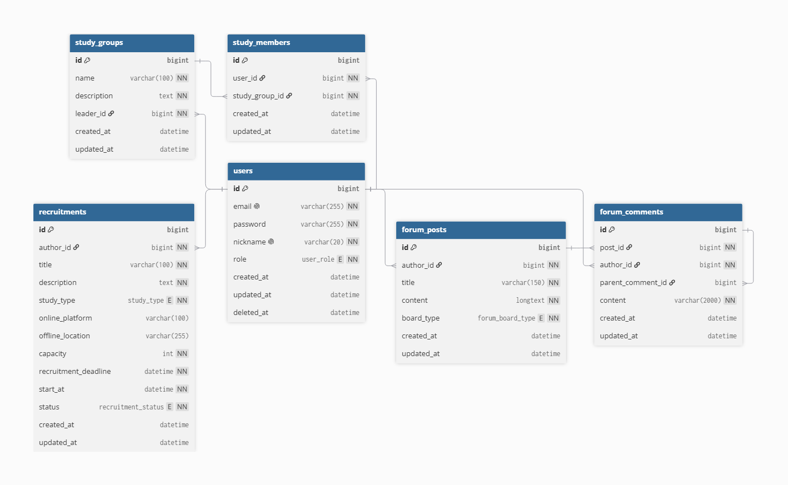

# Learning Mate

> 함께 공부할 사람을 모집하고, 스터디 그룹을 운영하며, 커뮤니티에서 정보를 나눌 수 있는 학습 커뮤니티 백엔드 서비스입니다.

Learning Mate는 사용자 인증을 기반으로 모집공고 작성, 스터디 그룹 운영, 게시글과 댓글 작성을 지원하는 REST API 프로젝트입니다. 각 도메인을 독립적인 패키지로 나누고, JWT 기반 인증 정보로 작성자와 사용자를 식별합니다.

## 목차

- [주요 기능](#주요-기능)
- [팀원 및 역할](#팀원-및-역할)
- [기술 스택](#기술-스택)
- [프로젝트 구조](#프로젝트-구조)
- [ERD](#erd)
- [API 요약](#api-요약)
- [로컬 실행 방법](#로컬-실행-방법)
- [인증 방식](#인증-방식)
- [테스트](#테스트)
- [협업 규칙](#협업-규칙)

## 주요 기능

| 도메인 | 기능 |
| --- | --- |
| 인증 | 회원가입, 로그인, Access Token·Refresh Token 발급 및 재발급 |
| 사용자 | 내 정보 조회, 회원 탈퇴, 역할 관리, 소프트 삭제 |
| 모집공고 | 작성, 전체·단건 조회, 수정, 모집 마감, 모집 취소, 작성자 권한 검증 |
| 스터디 그룹 | 그룹 생성, 전체·단건 조회, 수정, 삭제, 리더 권한 검증 |
| 스터디 멤버 | 그룹 참여, 멤버 목록 조회, 그룹 탈퇴 |
| 커뮤니티 | 게시글 작성·조회·수정·삭제, 게시판 유형별 조회, 페이징 |
| 댓글 | 댓글·대댓글 작성, 조회, 수정, 삭제 |

## 팀원 및 역할

| 팀원 | 담당 도메인 | 주요 담당 내용 |
| --- | --- | --- |
| 김예슬 | Community | Forum Posts, Forum Comments |
| 구스타보 | Study Group | Study Groups, Study Members |
| 윤수영 | Auth / User / Security | Spring Security, Users, 인증·인가 기반 구현 |
| 전현재 | Recruitment | Recruitments, JWT 로그인 사용자와 모집공고 작성자 연결 |

## 기술 스택

| 구분 | 기술 |
| --- | --- |
| Language | Java 21 |
| Framework | Spring Boot 4.1.0, Spring MVC |
| Persistence | Spring Data JPA, Hibernate |
| Security | Spring Security, JWT (JJWT 0.13.0), BCrypt |
| Validation | Jakarta Bean Validation |
| Database | MySQL 8.4 |
| Local Infrastructure | Docker, Docker Compose |
| Build | Gradle Wrapper |
| Test | JUnit 5, Spring Boot Test, Testcontainers |
| Utility | Lombok |

## 프로젝트 구조

```text
src/main/java/com/innorun/learningmate
├── auth            # 회원가입, 로그인, 토큰 재발급
├── user            # 사용자 조회, 탈퇴, 역할 관리
├── recruitment     # 모집공고 작성, 조회, 수정, 마감, 취소
├── studygroup      # 스터디 그룹 관리
├── studymember     # 스터디 그룹 멤버 관리
├── Community       # 게시글과 댓글 관리
└── global
    ├── config      # 전역 예외 처리
    ├── entity      # 공통 생성·수정 시간, 소프트 삭제 엔티티
    ├── exception   # 공통 서비스 예외
    └── security    # Spring Security, JWT 필터, 인증 사용자 주입
```

각 도메인은 다음 계층을 기본으로 구성합니다.

```text
Controller → Service → Repository → Entity → Database
                 ↓
             Validator
```

- `Controller`: HTTP 요청과 응답 처리
- `Service`: 트랜잭션과 비즈니스 로직 처리
- `Repository`: 데이터베이스 접근
- `Entity`: 도메인 데이터와 상태 관리
- `DTO`: 계층 간 요청·응답 데이터 전달
- `Validator`: 복합적인 도메인 입력 규칙 검증

## ERD



### 주요 테이블 관계

| 기준 테이블 | 관계 | 연결 테이블 | 설명 |
| --- | --- | --- | --- |
| `users` | 1:N | `recruitments` | 한 사용자는 여러 모집공고의 작성자가 될 수 있습니다. |
| `users` | 1:N | `study_groups` | 한 사용자는 여러 스터디 그룹의 리더가 될 수 있습니다. |
| `users` | 1:N | `study_members` | 한 사용자는 여러 스터디 그룹에 참여할 수 있습니다. |
| `study_groups` | 1:N | `study_members` | 하나의 스터디 그룹은 여러 멤버를 가질 수 있습니다. |
| `users` | 1:N | `forum_posts` | 한 사용자는 여러 게시글을 작성할 수 있습니다. |
| `forum_posts` | 1:N | `forum_comments` | 하나의 게시글은 여러 댓글을 가질 수 있습니다. |
| `users` | 1:N | `forum_comments` | 한 사용자는 여러 댓글을 작성할 수 있습니다. |
| `forum_comments` | 1:N | `forum_comments` | `parent_comment_id`를 통해 대댓글 구조를 표현합니다. |

### 주요 Enum

| Enum | 값 |
| --- | --- |
| `Role` | `USER`, `ADMIN` |
| `StudyType` | `ONLINE`, `OFFLINE`, `HYBRID` |
| `RecruitmentStatus` | `OPEN`, `CLOSED`, `CANCELLED` |
| `ForumBoardType` | `JOB_INFO`, `CAREER_QNA`, `FREE` |

## API 요약

기본 주소는 `http://localhost:8080`입니다.

### 인증

| Method | Endpoint | 설명 | 인증 |
| --- | --- | --- | --- |
| `POST` | `/auth/signup` | 회원가입 | 불필요 |
| `POST` | `/auth/login` | 로그인 및 토큰 발급 | 불필요 |
| `POST` | `/auth/reissue` | Access Token·Refresh Token 재발급 | 불필요 |

### 사용자

| Method | Endpoint | 설명 | 인증 |
| --- | --- | --- | --- |
| `GET` | `/users/me` | 내 정보 조회 | 필요 |
| `DELETE` | `/users/me` | 회원 탈퇴 | 필요 |
| `DELETE` | `/users/{userId}` | 사용자 탈퇴 처리 | 필요 |

### 모집공고

| Method | Endpoint | 설명 | 인증 |
| --- | --- | --- | --- |
| `POST` | `/recruitments` | 모집공고 작성 | 필요 |
| `GET` | `/recruitments` | 모집공고 전체 조회 | 현재 필요 |
| `GET` | `/recruitments/{recruitmentId}` | 모집공고 단건 조회 | 현재 필요 |
| `PUT` | `/recruitments/{recruitmentId}` | 모집공고 수정 | 작성자 |
| `PATCH` | `/recruitments/{recruitmentId}/close` | 모집 마감 | 작성자 |
| `PATCH` | `/recruitments/{recruitmentId}/cancel` | 모집 취소 | 작성자 |

> 현재 보안 설정에서는 인증 API를 제외한 모든 요청에 JWT가 필요합니다. 모집공고 조회 공개 여부는 팀 정책에 맞춰 보안 설정에서 조정합니다.

### 스터디 그룹 및 멤버

| Method | Endpoint | 설명 | 인증 |
| --- | --- | --- | --- |
| `POST` | `/study-groups` | 스터디 그룹 생성 | 필요 |
| `GET` | `/study-groups` | 스터디 그룹 전체 조회 | 현재 필요 |
| `GET` | `/study-groups/{studyGroupId}` | 스터디 그룹 단건 조회 | 현재 필요 |
| `PUT` | `/study-groups/{studyGroupId}` | 스터디 그룹 수정 | 리더 |
| `DELETE` | `/study-groups/{studyGroupId}` | 스터디 그룹 삭제 | 리더 |
| `POST` | `/study-groups/{studyGroupId}/members` | 스터디 그룹 참여 | 필요 |
| `GET` | `/study-groups/{studyGroupId}/members` | 스터디 멤버 목록 조회 | 현재 필요 |
| `DELETE` | `/study-groups/{studyGroupId}/members` | 스터디 그룹 탈퇴 | 필요 |

### 커뮤니티 게시글

| Method | Endpoint | 설명 | 인증 |
| --- | --- | --- | --- |
| `POST` | `/forum/posts` | 게시글 작성 | 필요 |
| `GET` | `/forum/posts` | 게시글 목록 조회 | 현재 필요 |
| `GET` | `/forum/posts/{postId}` | 게시글 단건 조회 | 현재 필요 |
| `PUT` | `/forum/posts/{postId}` | 게시글 수정 | 작성자 |
| `DELETE` | `/forum/posts/{postId}` | 게시글 삭제 | 작성자 |

게시글 목록은 `boardType`, `page`, `size`, `sort` 쿼리 파라미터를 사용할 수 있습니다.

```text
GET /forum/posts?boardType=FREE&page=0&size=20&sort=createdAt,desc
```

### 커뮤니티 댓글

| Method | Endpoint | 설명 | 인증 |
| --- | --- | --- | --- |
| `POST` | `/forum/posts/{postId}/comments` | 댓글 또는 대댓글 작성 | 필요 |
| `GET` | `/forum/posts/{postId}/comments` | 게시글 댓글 목록 조회 | 현재 필요 |
| `GET` | `/forum/comments/{commentId}` | 댓글 단건 조회 | 현재 필요 |
| `PUT` | `/forum/comments/{commentId}` | 댓글 수정 | 작성자 |
| `DELETE` | `/forum/comments/{commentId}` | 댓글 삭제 | 작성자 |

## 로컬 실행 방법

### 1. 준비 사항

- JDK 21
- Docker Desktop 및 Docker Compose
- Git

### 2. 저장소 복제

```bash
git clone https://github.com/Innorun-IFP/learning-mate.git
cd learning-mate
```

### 3. 환경 변수 파일 생성

프로젝트 루트의 `.env.example`을 복사하여 `.env.local`을 만듭니다.

Windows PowerShell:

```powershell
Copy-Item .env.example .env.local
```

macOS/Linux:

```bash
cp .env.example .env.local
```

`.env.local` 예시:

```properties
DB_HOST=localhost
DB_PORT=3306
DB_NAME=learning_mate
DB_USERNAME=learning_mate
DB_PASSWORD=local_password
MYSQL_ROOT_PASSWORD=local_root_password
JWT_SECRET=Base64로_인코딩한_32바이트_이상의_비밀키
```

JWT 비밀키 예시는 다음 명령으로 생성할 수 있습니다.

```bash
openssl rand -base64 32
```

> `.env.local`에는 비밀번호와 JWT 비밀키가 포함되므로 Git에 커밋하지 않습니다.

### 4. MySQL 실행

Windows:

```powershell
.\gradlew.bat dbUp
```

macOS/Linux:

```bash
./gradlew dbUp
```

### 5. 애플리케이션 실행

Windows:

```powershell
.\gradlew.bat bootRun --args="--spring.profiles.active=local"
```

macOS/Linux:

```bash
./gradlew bootRun --args='--spring.profiles.active=local'
```

애플리케이션은 기본적으로 `http://localhost:8080`에서 실행됩니다.

### 6. MySQL 종료

Windows:

```powershell
.\gradlew.bat dbDown
```

macOS/Linux:

```bash
./gradlew dbDown
```

### 개발 환경 주의사항

현재 JPA 설정은 다음과 같습니다.

```properties
spring.jpa.hibernate.ddl-auto=create
```

애플리케이션을 다시 실행하면 스키마가 재생성되어 기존 로컬 데이터가 초기화될 수 있습니다. 운영 또는 공유 환경에서는 Flyway 등의 마이그레이션 도구와 `validate` 설정 도입을 검토해야 합니다.

## 인증 방식

회원가입 후 로그인 API를 호출하면 Access Token과 Refresh Token이 발급됩니다.

인증이 필요한 API는 요청 헤더에 Access Token을 전달합니다.

```http
Authorization: Bearer {accessToken}
```

서버는 JWT에서 로그인 사용자 ID와 역할을 확인합니다. 작성·수정·삭제와 같은 기능에서는 클라이언트가 임의로 전달한 사용자 ID보다 인증된 사용자 정보를 우선하여 권한을 검증합니다.

## 테스트

테스트 실행 전 MySQL 컨테이너를 실행하고 `local` 프로필을 활성화합니다.

Windows PowerShell:

```powershell
$env:SPRING_PROFILES_ACTIVE="local"
.\gradlew.bat test
```

macOS/Linux:

```bash
SPRING_PROFILES_ACTIVE=local ./gradlew test
```

## 협업 규칙

### 브랜치 전략

- `dev`: 기능 통합 브랜치
- `feature/{domain-or-feature}`: 기능 개발 브랜치
- 기능 개발은 최신 `dev`에서 분기합니다.
- 작업 완료 후 `dev`를 대상으로 PR을 생성합니다.
- PR 리뷰와 승인을 거친 뒤 병합합니다.

예시:

```text
feature/recruitment
feature/study-group
feature/community
```

### 커밋 메시지

| 타입 | 용도 |
| --- | --- |
| `feat` | 새로운 기능 추가 |
| `fix` | 오류 수정 |
| `refactor` | 기능 변화 없는 코드 구조 개선 |
| `test` | 테스트 추가 또는 수정 |
| `docs` | 문서 수정 |
| `chore` | 설정 및 기타 작업 |

예시:

```text
feat: 모집공고 작성 API 추가
fix: 모집공고 작성자 권한 검증 수정
docs: 프로젝트 README 작성
```

### PR 작성 기준

- 한 PR에는 하나의 기능 또는 하나의 목적만 포함합니다.
- 변경 내용과 테스트 결과를 PR 본문에 작성합니다.
- 관련 없는 파일은 커밋에 포함하지 않습니다.
- 다른 담당자의 코드를 변경할 때는 먼저 변경 이유를 공유합니다.
- 병합 전 로컬 빌드와 테스트 성공 여부를 확인합니다.

## Repository

- GitHub: [Innorun-IFP/learning-mate](https://github.com/Innorun-IFP/learning-mate)

